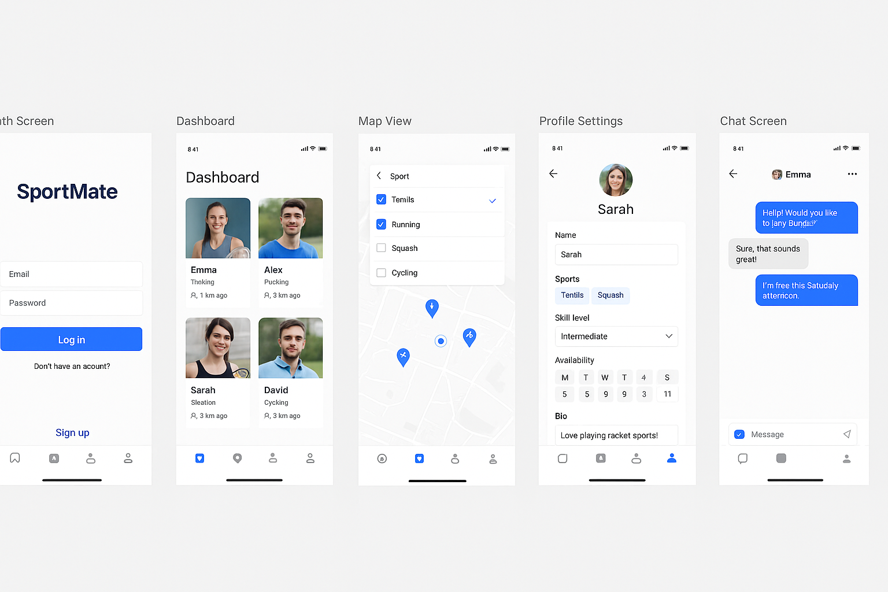

# ZagrajMy 🏃‍♂️🎾

**Progressive Web App** do wyszukiwania partnerów sportowych (bieganie, tenis, squash itd.)

---

## Opis projektu

ZagrajMy to nowoczesna web‑apk (PWA) stworzona w Next.js, pozwalająca użytkownikom znaleźć partnera do sportu na bazie lokalizacji, poziomu zaawansowania oraz dostępnych terminów.  
Integruje realtime chat i mapy – szybkie MVP z perspektywą rozwoju do pełnej natywnej aplikacji.

---

## 🧠 Architektura

/app → Routing Next.js App Router
├── /auth → Logowanie i rejestracja
├── /dashboard → Główna lista dopasowań
├── /match → Widok mapy i filtrów
├── /chat → Wiadomości i rozmowy
├── /profile → Edycja profilu użytkownika
└── /settings → Ustawienia konta

/components → Współdzielone komponenty UI
├── MatchCard.tsx
├── ChatBubble.tsx
├── SportFilterDropdown.tsx
├── AvailabilityCalendar.tsx
└── NavbarMobile.tsx

/lib
├── supabaseClient.ts → Konfiguracja Supabase
└── geoutils.ts → Funkcje pomocnicze dot. lokalizacji

/types
└── index.ts → Typy TypeScript (User, Match, Message)

/public → Statyczne zasoby (ikony, manifest PWA)

/styles
└── tailwind.config.js + global.css

## 🚀 Tech stack

- **Next.js** (App Router) – SSR + routing po stronie serwera.
- **React** (+ TypeScript) – komponenty, logika, obsługa stanu.
- **Tailwind CSS** – szybkie stylowanie i responsive design.
- **Supabase** – baza PostgreSQL + Auth + Realtime (chat).
- **Mapbox** – wyświetlanie mapy i pinezek.
- **PWA** – service worker, manifest.json, offline support.

---

## 🗃️ Baza danych (Supabase)

- `users`: id, name, email, sports[], skill_level, availability (JSON), location (geopoint), bio
- `matches`: id, user1_id, user2_id, status (enum), created_at
- `messages`: id, match_id, sender_id, message, created_at

Realtime Subscriptions: `messages` → live chat w UI.

---

## 🔁 Flow aplikacji (MVP)

1. **Auth** – Supabase Auth UI (email + magic link / password).
2. **Profil** – wybór sportów, poziomu, dostępności, lokalizacja geograficzna.
3. **Matchmaking** – lista użytkowników wg filtru + przycisku “Zaproś”.
4. **Map View** – pinezki + filtr sportów + odległość.
5. **Spotkania** – zaproszenie → status `pending` / `accepted`.
6. **Chat** – realtime chat z Supabase Realtime.
7. **PWA** – instalowalna, offline cache, splash screen.

---

## 🖥️ Mock

## 

## 📂 Instalacja i uruchomienie

```bash
npm run dev
# or
yarn dev
# or
pnpm dev
# or
bun dev
```
